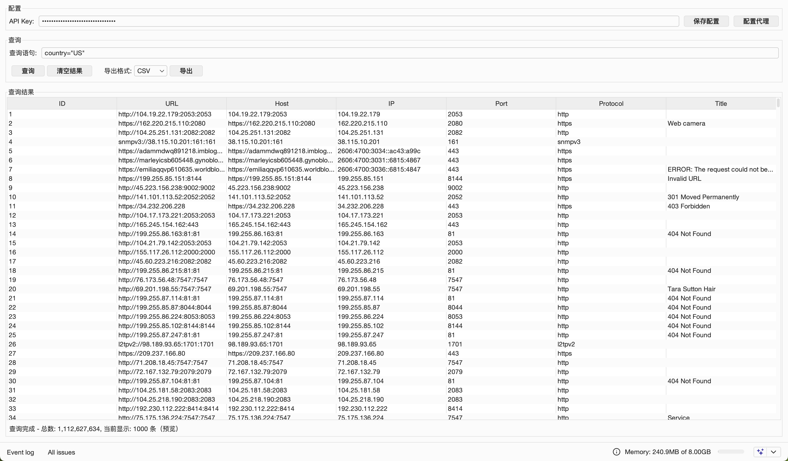

# FOFA Burp Suite 插件

一个集成 FOFA API 的 Burp Suite 扩展插件，允许在 Burp Suite 中直接查询 FOFA 数据并导出结果。



## 功能特性

- ✅ 集成 FOFA API 进行资产发现
- ✅ 支持自定义查询语句
- ✅ 分页查询与导出支持
- ✅ 结果表格展示（支持排序）
- ✅ 导出为 CSV 或 TXT 格式（自动去重）
- ✅ SOCKS5 代理配置
- ✅ 配置持久化保存

## 系统要求

- Burp Suite Professional/Community (支持 Montoya API)
- Java 17 或更高版本
- FOFA API Key

## 安装方法

### 方式一：使用预编译的 JAR 文件

1. 从 [Releases](../../releases) 下载最新的 `Fofa-1.0.0-jar-with-dependencies.jar`
2. 打开 Burp Suite
3. 进入 `Extensions` → `Installed` → `Add`
4. 选择下载的 JAR 文件
5. 点击 `Next` 完成安装

### 方式二：从源码编译

```bash
# 克隆仓库
git clone https://github.com/Minshenyao/fofaPlugin.git
cd fofaPlugin

# 编译打包
mvn clean package

# 生成的插件位于
# target/Fofa-1.0.0-jar-with-dependencies.jar
```

## MCP 集成

> **告别手动输入 FOFA 语法，AI 全自动资产搜集。**

插件内置 MCP (Model Context Protocol) server，加载后会自动在本机 `38080` 端口启动。对接 Claude Code、Codex 等 AI 客户端后，**AI 在协助渗透测试时可以自动调用 FOFA 进行资产扩散**——从一个域名、IP 或关键词出发，自主完成子域名、C 段、关联站点等资产的测绘与收集，并将结果直接带入后续测试流程，无需你手动逐条查询。

典型场景：

- 给定目标域名，自动发现其全部子域名与关联站点
- 给定目标 IP，自动测绘其所在 C 段开放的 Web 服务
- 按标题、证书、ICON 等特征横向扩展出同组织的其他资产

> 前提：已在 Burp 中加载本插件，并在 FOFA 标签页配置好 API Key。

### Claude Code 对接

在 `~/.claude.json` 中添加如下配置：

```json
{
  "mcpServers": {
    "fofa": {
      "type": "sse",
      "url": "http://127.0.0.1:38080"
    }
  }
}
```

### Codex 对接

在 `~/.codex/config.toml` 中添加如下配置（需本机已安装 Node.js，提供 `npx` 命令）：

```toml
[mcp_servers]

[mcp_servers.fofa]
type = "stdio"
command = "npx"
args = ["-y", "supergateway", "--sse", "http://127.0.0.1:38080"]
```

### 可用工具

| 工具 | 说明 |
|------|------|
| `fofa_search` | 单次查询 FOFA 资产，支持分页、指定返回数量与输出格式 |
| `fofa_search_batch` | 批量多页查询，自动分页、去重，并实时推送进度 |

### 使用示例

对接完成后，在渗透过程中直接用自然语言让 AI 自动调用 FOFA 扩散资产：

```
对目标 example.com 做一次资产扩散，列出所有子域名和关联站点
我在测 1.2.3.4，看看它所在 C 段还有哪些开放的 Web 服务
根据这个站点的标题和 ICON 特征，扩展出同组织的其他资产
```

## 许可证

MIT License

## 贡献

欢迎提交 Issue 和 Pull Request！
